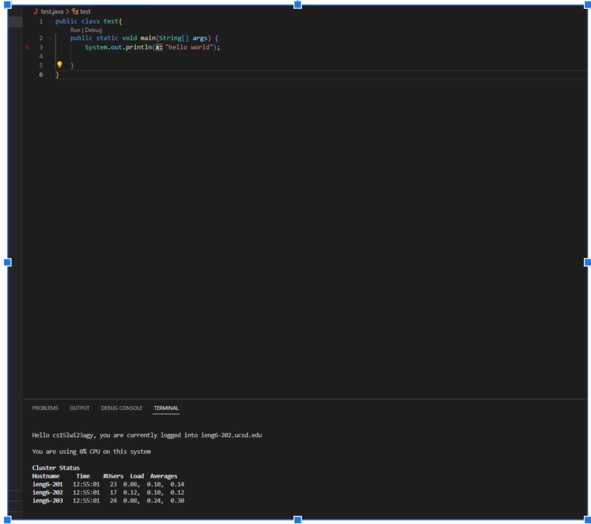

Lab Report 1

In the first week lab report we indutroduced ourselves to each other in the group, then we are starting to our practice of remote access.
First step, we download the Visual Studio Code and how to set up the coding environment.(Installing VScode)

In second step, we are remotely connecting by using ssh with our specific account. There will be a confirm message, when we type yes, we are required to type the password we just changed for our account.(Remotely Connecting)

next part, we used some useful command.(Trying Some Commands)

At end of the lab, we learned how to create our own github webpage and how to design the post. That is all!
